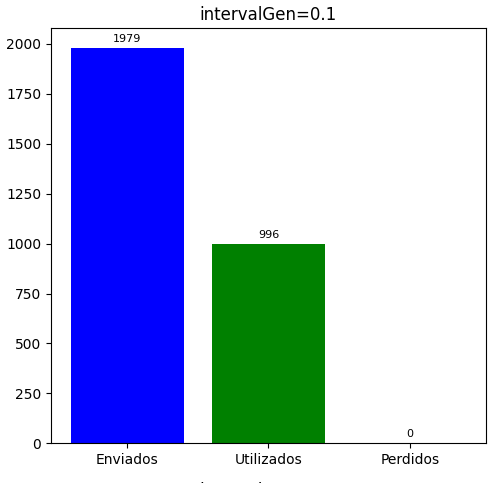
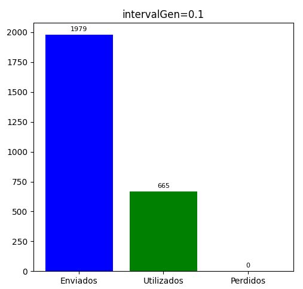

# Análisis de flujo y congestión en una red simulada en Omnet++

# Grupo 48

# Integrantes:
- Ferré, Eduardo
- Mariano, Matteo
- Navarro, Francisco

## Resumen
En este laboratorio, exploramos el tráfico de redes utilizando simulaciones discretas con Omnet++, con el propósito de comprender y resolver problemas en la Capa de Transporte. Configuramos una red compuesta por varios nodos encargados de transportar paquetes entre sí. Nos centramos en analizar cómo la red responde ante distintas tasas de transmisión y otros parámetros. Finalmente diseñamos una estrategia para controlar la congestión y el flujo de la red, con el objetivo de mejorar su eficiencia.

## Introducción
En el contexto de las redes, la Capa de Transporte desempeña un papel crucial al garantizar la entrega confiable de datos entre nodos emisores y receptores. Sin embargo, esta capa se enfrenta a dos desafíos principales: el control de flujo y el control de congestión.

El **control de flujo** se encarga de regular la tasa de transferencia de datos entre un emisor y un receptor específico, asegurando que el receptor no se vea sobrecargado por una cantidad excesiva de datos que supere su capacidad de procesamiento. Por otro lado, el **control de congestión** se enfoca en evitar la saturación de la red en sí, regulando el tráfico total que fluye a través de ella para no exceder su capacidad de transferencia limitada.

En este laboratorio, exploramos estos conceptos mediante simulaciones discretas utilizando OMNeT++, una herramienta de simulación de eventos discretos que nos permite recrear el comportamiento de una red compuesta por nodos que transmiten paquetes entre sí.

En la primera parte del laboratorio, configuramos dos casos de estudio que representan situaciones de control de flujo y congestión, respectivamente. Mediante experimentos paramétricos, variamos factores clave como las tasas de transmisión y los tamaños de buffer, y evaluamos su impacto en el rendimiento de la red, midiendo métricas como la cantidad de paquetes recibidos y perdidos durante la transferencia.
Posteriormente, en la segunda parte, diseñamos e implementamos una estrategia de control de flujo y congestión con el objetivo de mejorar la eficiencia de la red, reduciendo la pérdida de paquetes y optimizando la utilización de los recursos disponibles.


## Tarea Análisis

Esta primera tarea nos ayudará a comprender la diferencia entre control de flujo y control de congestión. Para ello, modelamos la siguiente red:

<p align="center">
  
  <br>
  <em>Modelo de red</em>
</p>

### Primer caso de estudio

| Connection         | Datarate  | Delay  |
| ------------------ | ----------| ------ |
| `NodeTx` a `Queue` | `1.0 Mbps`| 100 us |
| `Queue` a `NodeRx` | `1.0 Mbps`| 100 us |
| `Queue` a `Sink`   | `0.5 Mbps`|        |

Observemos que la tasa de transferencia de `Queue` a `NodeRx` es mayor a la tasa de transferencia de `Queue` a `Sink`, es decir, el buffer de `NodeRx` va a estar recibiendo más paquetes de los que va a estar enviando. Por ende, si se envían muchos paquetes en la red, es decir, si el intervalo de generación es más pequeño, el buffer de `NodeRx` se va a saturar. Esto sucede porque `NodeRx` no puede procesar y enviar los paquetes tan rápido como están llegando. Como resultado, los paquetes se acumularán en el buffer de `NodeRx`, esperando ser procesados y enviados hacia `Sink`. Esta saturación puede causar demoras en la entrega de los paquetes, y también provoca pérdida de paquetes si el buffer se llena por completo.

Ilustremos esto mediante distintas graficas:

<p align="center">
  
  <br>
  <em>Caso 1: Ocupación del buffer</em>
</p>

Notemos que a medida de que el intervalo de generación aumenta, la ocupación del buffer disminuye, puesto que los paquetes tienen mas tiempo para ser procesados y enviados a `Sink` antes de que llegue el siguiente paquete.


<p align="center">
  
  <br>
  <em>Caso 1: Paquetes</em>
</p>

Esto confirma lo dicho anteriormente, si los paquetes se generan con menos frecuencia, hay más tiempo para procesar cada paquete, lo que reduce la probabilidad de que se pierdan paquetes debido a la saturación del buffer.


### Segundo caso de estudio

| Connection         | Datarate  | Delay  |
| ------------------ | ----------| ------ |
| `NodeTx` a `Queue` | `1.0 Mbps`| 100 us |
| `Queue` a `NodeRx` | `0.5 Mbps`| 100 us |
| `Queue` a `Sink`   | `1.0 Mbps`|        |

 En este caso, la tasa de transferencia de `Queue` a `NodeRx` es 0.5 Mbps, que es menor que la tasa de transferencia de `NodeTx` a `Queue`, que es de 1.0 Mbps. Por lo tanto, de manera análoga al caso anterior, si se generan paquetes con alta frecuencia (es decir, si el intervalo de generación es pequeño), el buffer  `Queue` se satura rápidamente, ya que los paquetes llegan más rápido de lo que pueden ser procesados y enviados a `NodeRx`.

 Observemos las siguientes gráficas:

<p align="center">
  
  <br>
  <em>Caso 2: Ocupación del buffer</em>
</p>


 <p align="center">
  
  <br>
  <em>Caso 2: Paquetes</em>
</p>

### Control de flujo vs control de congestión

Podemos visualizar que las gráficas obtenidas son parecidas en ambos casos de estudio. Esto es porque
en ambos casos lo que esta pasando  es que un nodo recibe a una velocidad de 1Mbps pero solo los procesa a una velocidad de 0.5Mbps, solo que la diferencia ocurre en el nodo que sucede el cuello de botella.
Se puede decir que en el caso de estudio 1 se tiene una red veloz que alimenta a un receptor de baja capacidad, lo cual se corresponde con un problema de control de flujo. En cambio, en el caso de estudio 2 se tiene una red lenta que alimenta a un receptor de alta capacidad, por lo que se trata de un problema de control de congestión.

## Tarea Diseño

### Algoritmo parada y espera simple

El algoritmo que proponemos para solucionar los problemas de flujo y congestión, llamado parada y espera simple, consiste en que para cada paquete de datos enviado, el nodo emisor espera una confirmación del nodo receptor y no hace más nada hasta que la recibe. Por su parte, el nodo receptor envía una confirmación al nodo emisor cada vez que  procesa un paquete de datos y libera el espacio correspondiente en su buffer. El algoritmo se resume en el siguiente codigo (abstrayendo detalles de implementación que no son relevantes para este trabajo):

```C++
// Nodo emisor
while(true){
  if(!esperandoConfirmacion){
    esperandoConfirmacion = true;
    enviarPaqueteAlReceptor();
  }
  else if(receptorEnviaConfirmacion){
    esperandoConfirmacion = false;
  }
}
```
```C++
// Nodo receptor
while(true){
  procesarSiguientePaquete();
  enviarConfirmacionAlEmisor();
}

```

El modelo sobre el que realizamos el análisis ahora debe contar con un canal de retorno desde el receptor hacia el emisor, para que el receptor sea capaz de enviar las confirmaciones al emisor. Por ello, ahora nuestro modelo luce así:

<p align="center">
  
  <br>
  <em>Modelo de red</em>
</p>


### Resultados del diseño

Para el problema de control de flujo en los casos donde había pérdida de paquetes, obtuvimos las siguientes mediciones del algoritmo en Omnet++:

<p align="center">
  
  <br>
  <em>Caso 1: Ocupación del buffer</em>
</p>

<p align="center">
  
  <br>
  <em>Caso 1: Paquetes</em>
</p>

No hubo pérdida de paquetes. Lo mismo ocurrió para el problema de control de congestión:

<p align="center">
  
  <br>
  <em>Caso 2: Ocupación del buffer</em>
</p>

<p align="center">
  
  <br>
  <em>Caso 2: Paquetes</em>
</p>

Podemos decir entonces que parada y espera simple soluciona los problemas de flujo y congestión que vimos antes, pero ¿a qué costo?

### Problemas del diseño

Notemos que en el caso donde se genera más cantidad de paquetes, por más que no hay pérdidas la cantidad de paquetes utilizados dista mucho de la cantidad de paquetes enviados. Además, el tamaño del buffer del nodo emisor crece sin límite. Esto ocurre ya que el nodo emisor genera paquetes más rápido de lo que puede desencolarlos, porque por el diseño de nuestro algoritmo, para enviar cada paquete primero se debe esperar a que llegue una confirmación desde el nodo receptor. Es decir, volvemos a estar en presencia de un cuello de botella, pero esta vez en el nodo emisor. Sin embargo, como nuestro modelo asume que el bufer de salida del emisor no es una limitante, no se produce pérdida de paquetes. El siguiente gráfico muestra el estancamiento producido comparando la carga transmitida con la carga recibida:

<p align="center">
  
  <br>
  <em>Carga Transmitida vs Carga recibida</em>
</p>

Otra falencia de nuestro algoritmo es que se asume que el nodo emisor siempre recibirá una confirmación, cuando en una red real esto podría no pasar; en dicho caso, el nodo emisor se quedaría esperando para siempre. Una solución posible es hacer que el nodo emisor vuelva a enviar el último paquete que envió, pasado cierto tiempo sin recibir una confirmación.

## Anexo

A pesar de que en otras ocasiones hemos usado herramientas de inteligencia artificial, en este trabajo ningún integrante del grupo lo hizo.

## Referencias

Tanembaum. Computer Networks: quinta edición del 2011.


