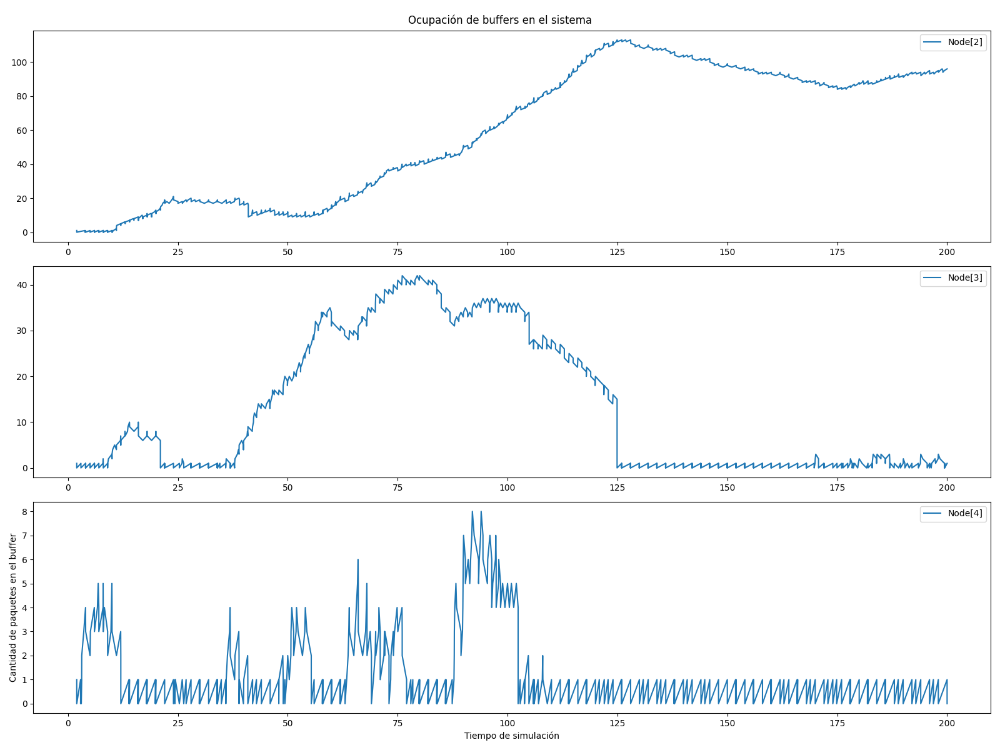

# Análisis y Diseño de Algoritmos de Enrutamiento en la Capa de Red 

# Grupo 48

# Integrantes:
- Ferré, Eduardo
- Mariano, Matteo
- Navarro, Francisco

## Resumen
En este informe se presenta un análisis y diseño de algoritmos de enrutamiento en la capa de red, utilizando modelos de red en Omnet++. Analizaremos diferentes estrategias para mejorar el rendimiento del sistema a partir de un modelo de red representada en un modelo de anillo de 8 nodos, unidos con dos posibles vecinos por el modelo full-dúplex, donde cada nodo está formado por dos capas de enlace, una de red y una de aplicación. Se evalúan distintas métricas como la demora en la entrega de paquetes, la cantidad de saltos, y la utilización de los recursos de la red. Y finalmente se propone un nuevo algoritmo de enrutamiento y se compara su rendimiento con el modelo inicial.

## Introducción
En el contexto de la capa de red, el enrutamiento es el proceso de seleccionar la mejor ruta para un paquete de datos a través de una red. Existen diferentes algoritmos de enrutamiento que se pueden utilizar para determinar la ruta óptima de un paquete. En este informe, analizaremos y compararemos distintos algoritmos de enrutamiento dentro de una red con topología en anillo.

El informe se estructura en distintas secciones, comenzando con un análisis detallado del algoritmo de enrutamiento inicial provisto por la cátedra. A continuación, se diseñará y propondrá un nuevo algoritmo de enrutamiento que busque mejorar las limitaciones del enfoque inicial.  En particular, se enfocará en lograr un mejor rendimiento en términos de **carga en los nodos**. Finalmente, se presentarán los resultados de la simulación y se compararán los resultados obtenidos con el algoritmo inicial y el nuevo algoritmo propuesto. 

Las métricas que consideramos en este análisis incluyen la demora en la entrega de paquetes, la cantidad de saltos utilizados por cada paquete y la utilización de los recursos de la red, como buffers y enlaces.


## Tarea Análisis
En esta sección se analiza el rendimiento del sistema de enrutamiento bajo diferentes condiciones de tráfico utilizando el modelo de red en anillo con 8 nodos.


Cada nodo cuenta dos interfaces de comunicación full-duplex, una para establecer conexión con el nodo de la izquierda y otra para comunicarse con el nodo de la derecha.

La capa de enlace y la capa de aplicación de cada nodo tienen generadores de tráfico y buffers respectivamente.

El algoritmo provisto por la cátedra envía los paquetes en una única dirección, siguiendo el sentido de las agujas del reloj, utilizando siempre la interfaz número 0. Esta estrategia implica que cada paquete, sin importar su destino, siempre recorrerá el anillo en el mismo sentido, lo que puede generar varios problemas, analicemos distintos casos de estudio para evaluar el rendimiento del sistema de enrutamiento.

### Primer caso de estudio
En el primer caso de estudio, se configura el modelo para que los nodos _node[0]_ y _node[2]_ transmitan datos al nodo _node[5]_. Este escenario podremos observar el comportamiento del sistema de enrutamiento cuando hay múltiples fuentes de tráfico dirigiendo paquetes a un mismo destino.

En este caso de estudio, podemos ver como se hace un uso excesivo aumenta del buffer en _node[0]_, puesto que es un punto de encuentro entre los paquetes que genera el _node[2]_ y los que genera el _node[0]_.  

Observemos las siguientes gráficas que muestra la cantidad de paquetes en los buffers de los nodos en función del tiempo:


En particular, podemos ver como el buffer del _node[0]_ se llena rápidamente, puesto que _node[2]_ produce una congestión que se podria evitar si no mandar los paquetes para el lado derecho.

Otra forma posible ver el desempeño del algoritmo es viendo la cantidad de saltos entre nodos que realiza cada paquete hasta llegar al _node[5]_, las metricas obtenidas al correr la simulacion nos indican que para enviar de _node[0]_ a _node[5]_ se realizan 3 saltos, y para _node[2]_ a _node[5]_ se realizan 5 saltos, pero observando el network simulado es facil ver que si se hubiese enviado el paquete en sentido antihorario se podria haber alcanzado el destino con solo 3 saltos, es decir se realizan mas saltos de los realmente necesarios.

Tambien podemos analizar el uso de la network en base a la cantidad de veces que se envian paquetes en una interfaz. En este caso especifico obtenemos que entre todos los nodos se usó _lnk[0]_ 1158 veces para enviar paquetes, mientras que _lnk[1]_ no se utilizó, lo cual es evidente dado el algoritmo de enrutamiento usado. Es facil ver que este uso de la red no es el optimo, como ambos nodos emisores estan a la misma distancia de _node[5]_ lo ideal seria que la cantidad de veces que se usa cada interfaz en total sea igual.
Es importante aclarar que eso sucederia en este caso de estudio o similares, es decir que en casos que los nodos emisores tengan la misma distancia con el destino. Pero, por ejemplo, en el caso de que solo _node[0]_ envie a _node[5]_ lo ideal seria enviar solo por _lnk[0]_.


### Segundo caso de estudio
En el segundo caso de estudio, todos los nodos (excepto el nodo de destino _node[5]_) generan tráfico hacia _node[5]_, con packetByteSize e interArrivalTime idénticos entre todos los nodos. 

Aquí podemos ver claramente la congestión que se produce, en particular el _node[4]_ esta a un salto del nodo destino, sin embargo como este algortimo siempre manda los paquetes en sentido horario el paquete tiene que dar toda la vuelta al anillo para llegar al destino. Lo cual no es muy eficiente en terminos tanto como de tiempo como de recursos.

Podemos ver que al utilizar  

```cpp
interArrivalTime = exponential(1);
```
como valor por defecto proporcionado por la cátedra, obtenemos las siguientes métricas para los buffers:


Observando estos graficos notamos que los buffers de todos los nodos aumentan constantemente durante toda la simulacion, excepto por el buffer del nodo 4, el cual no aumenta de esa forma ya que solo llegan a ese buffer los paquetes que genera su aplicacion, en cambio en los demas buffers llegan paquetes tanto de su respectiva aplicacion como los generados por los nodos anteriores.

Entonces, _¿Qué intervalo de generacion de paquetes necesitamos para lograr que el network sea estable?_

La respuesta logica es que se genere un paquete cada vez que un paquete generado por el _node[4]_ llegue al destino _node[5]_, ya que cada uno de los nodos 0, 1, 2, 3, 6 y 7 realizan menos saltos para llegar a _node[5]_ que _node[4]_, por lo que tardan menos en llegar al destino, entonces los nodos no van a generar paquetes hasta que el paquete de _node[4]_ haya llegado a _node[5]_ y por lo tanto los paquetes de los demas nodos tambien, ya que tardan menos.

Es decir, 
1. Sea T el tiempo que tarda en llegar un paquete de _node[4]_ a _node[5]_, y 
2. interArrivalTime = exponential(T)

Para obtener T tenemos 2 opciones, calcular el tiempo o utilizar la métrica `duration` la cual indica el tiempo en segundos que tomo un paquete en ir de origen a destino:

#### Calculando:
Obtenemos el tiempo que tarda un paquete en hacer 1 salto individual, para ello:
``` 
(125000 B)/(1 Mbps) = (125000 * 8 b)/(1000000 b/s) = 1 segundo
```
Ahora, como de _node[4]_ a _node[5]_ se realizan 7 saltos:
``` 
T = 1 seg * 7 = 7 segundos
``` 
#### Usando la metrica de duracion:
Realicemos una simulacion donde solo _node[4]_ transmite a _node[5]_ y analicemos la métrica de duracion, la cual es de 7.0007 segundos, 
**entonces T = 7.0007 segundos**.

En conclusion podemos asumir que **T ≈ 7 segundos**.

Usando
```cpp 
interArrivalTime = exponential(7) 
``` 
obtenemos los siguientes graficos para los buffers:


Observando los graficos es facil notar que los buffers son mas estables, aunque con algunos picos, pero no crecen constantemente.

Para confirmar se puede hacer un nuevo analisis utilizando un interArrivalTime un poco mas chico, como por ejemplo: 
```cpp 
interArrivalTime = exponential(6.5) 
```  
y obtendriamos lo siguiente en los buffers:


Podemos ver que usando un interArrivalTime < 7 no es suficiente, ya que si bien los nodos 0, 1, 2, 3, 4 y 7 tienen buffers estables, el _node[6]_ crece constantemente a medida que avanza el tiempo.

#### Conclusion sobre el primer analisis:
Habiendo realizado este primer analisis sobre ambos casos de estudio, es evidente que las metricas tomadas pueden mejorar, para ello necesitamos un algoritmo que evite sobrecargar los buffers de los nodos y saque un mayor provecho de los recursos de la red.


## Tarea Diseño


### Algoritmo 
Sea `pkt` un paquete de datos. Nuestro algoritmo de enrutamiento se basa en dos principios:

1. Si el nodo actual es la fuente de `pkt`, entonces se lo envía por el enlace más conveniente.
2. Si el nodo actual no es la fuente de `pkt`, entonces se lo envía por el enlace que es distinto al enlace por el que pkt llegó (para evitar ciclos).

Cada nodo puede decidir qué enlace es más conveniente para enviar un paquete gracias a una tabla de dos entradas
```c++
simtime_t table[2];
```
```table[i]``` es la demora aproximada para atender un paquete enviado por el enlace i. Para calcular table[i], cada nodo envía cada cierto tiempo paquetes especiales `echo0` y `echo1` a través de sus enlaces 0 y 1 respectivamente
```c++
if(msg == sendEchoEvent){
    Packet *echo0 = new Packet("echo0");
    echo0->setSource(this->getParentModule()->getIndex());
    // el destino de un paquete echo es el mismo nodo por el que salio
    echo0->setDestination(this->getParentModule()->getIndex());
    Packet *echo1 = new Packet("echo1");
    echo1->setSource(this->getParentModule()->getIndex());
    echo1->setDestination(this->getParentModule()->getIndex());
    send(echo0, "toLnk$o", 0);
    send(echo1, "toLnk$o", 1);
    scheduleAt(simTime() + 2, sendEchoEvent);
}
```
Cada nodo que recibe un paquete echo lo reenvía hacia su origen
```c++
if(strcmp(pkt->getName(), "echo0") == 0){
    send(msg, "toLnk$o", 1);
    lnk1Uses++;
}
else if(strcmp(pkt->getName(), "echo1") == 0){
    send(msg, "toLnk$o", 0);
    lnk0Uses++;
}
```

Y cuando los paquetes echo regresan a su origen, se calcula table[i]
```c++
if(strcmp(pkt->getName(), "echo0") == 0){
    simtime_t delta = simTime() - pkt->getCreationTime();
    std::cout << delta <<"\n";
    table[0] = delta;
    delete pkt;
}
else if(strcmp(pkt->getName(), "echo1") == 0){
    simtime_t delta = simTime() - pkt->getCreationTime();
    std::cout << delta <<"\n";
    table[1] = delta;
    delete pkt;
}
```

Si un nodo es la fuente de un paquete, se usa el mínimo entre `table[0]` y `table[1]` para enrutar el paquete
```c++
if(pkt->getSource() == this->getParentModule()->getIndex()){
    pkt->setHopCount(pkt->getHopCount() + 1);
    if(table[0] < table[1]){
        send(msg, "toLnk$o", 0);
        lnk0Uses++;
    }
    else{
        send(msg, "toLnk$o", 1);
        lnk1Uses++;
    }
}
```

Si un nodo no es la fuente de un paquete, para enrutar el paquete se usa el enlace distinto al enlace por el que el paquete llegó al nodo.
```c++
else if(pkt->arrivedOn("toLnk$i", 1)){
    send(msg, "toLnk$o", 0);
    lnk0Uses++;
}
else if(pkt->arrivedOn("toLnk$i", 0)){
    send(msg, "toLnk$o", 1);
    lnk1Uses++;
}
```


### Resultados del diseño

#### Primer caso de estudio
Con nuestro nuevo algoritmo ahora analizamos los mismos buffers que analizamos inicialmente:


Podemos ver una clara mejora en la carga en los buffers de los nodos analizados anteriormente, es más, ahora absolutamente ninguno de los buffers de la red crece continuamente y el buffer que alcanza el pico de mayor valor es el de _lnk[1]_ de _node[2]_, con un valor de 17 paquetes en buffer, por lo tanto nuestro algoritmo mejora en gran medida la carga de los buffers de cada nodo, siendo este nuestro enfoque de mejora.

Tambien si analizamos la cantidad de veces que se usó cada puerta de enlace entre todos los nodos, obtenemos que en total se enviaron 1639 paquetes tanto por _lnk[0]_, como por _lnk[1]_, indicando otra mejora mas respecto al algoritmo inicial del laboratorio.

Finalmente podemos ver y analizar la cantidad de saltos que realizan los paquetes, de donde vemos que los paquetes de _node[2]_ realizan una menor cantidad de saltos que con el algoritmo inicial, aunque los paquetes de _node[0]_ aveces realizan mas saltos de los necesarios. Observemos la siguiente tabla:

| Nodo origen | Nodo destino | Promedio de Saltos (Algoritmo inicial)| Promedio de Saltos (Nuestro algoritmo) |
|-------------|--------------|---------------------------------------|----------------------------------------|
| 0           | 5            | 3                                     | 4.5                                    |
| 2           | 5            | 5                                     | 4.5                                    |

Notemos que en este caso de estudio, el promedio de saltos con nuestro algoritmo es mayor al promedio de saltos del algoritmo inicial.


### Segundo caso de estudio
Pongamos el foco en los buffers que analizamos anteriormente para ver la mejora que se obtiene con nuestro algoritmo:





Podemos ver que a diferencia del algoritmo provisto por la cátedra, nuestro algoritmo logra que la carga de los buffers de algunos nodos, sea mas estable con 
```cpp 
interArrivalTime = exponential(1) 
``` 
en particular, notemos que los buffers de los nodos 0, 1, 6 y 7, se asemejan a las gráficas anteriores, pero mejoran levemente, sin embargo el resto de nodos se nota una estabilidad clara a diferencia de antes.

Ahora notemos que mientras mas aumentemos **interArrivalTime**, se reduce la generación de paquetes, ahora bien, con el algoritmo anterior tuvimos que aumentar signficativamente el intervalo de **1** a **7**, sin embargo con nuestro algoritmo basta con aumentar el intervalo por ejemplo a **4**, para obtener una mejora significativa en la carga de los buffers, como se puede ver en las siguientes gráficas:


Es notoria la mejora en la carga de los buffers de todos los nodos. En particular _node[6]_, que era uno de los nodos que más carga presentaba su buffer con el algoritmo anterior.

Es por esto que podemos asegurar que nuestro algoritmo mejora la carga de los buffers de los nodos, el cual era nuestro enfoque principal.


Un último punto a analizar es la mejora en cuanto a saltos de nuestro algoritmo en este caso de estudio, observemos la siguiente tabla:

| Nodo origen | Nodo destino | Promedio de Saltos (Algoritmo inicial)| Promedio de Saltos (Nuestro algoritmo) |
|-------------|--------------|---------------------------------------|----------------------------------------|
| 0           | 5            | 3                                     | 3.45                                   |
| 1           | 5            | 4                                     | 4                                      |
| 2           | 5            | 5                                     | 3.6                                    |
| 3           | 5            | 6                                     | 2.8                                    |
| 4           | 5            | 7                                     | 2.08                                   |
| 6           | 5            | 1                                     | 1.82                                   |
| 7           | 5            | 2                                     | 2.82                                   |

Claramente se puede ver que nuestro algoritmo mejora la cantidad de saltos que realizan los paquetes para llegar a su destino, en particular los nodos 3 y 4 que realizan una cantidad de saltos significativamente menor que con el algoritmo inicial.

## Conclusión y crítica al algoritmo
Este trabajo pone en evidencia la importancia de la capa de red como capa encargada del enrutamiento de paquetes. Diseñar un buen algoritmo de enrutamiento es necesario para solucionar los problemas particulares a los que se enfrenta esta capa, que combinada con el resto de capas vistas en la materia, forman las redes que usamos todos los días.
Una crítica al algoritmo implementado es que seleccionar entre los  enlaces 0 y 1 en base a su demora no siempre es óptimo. Puede que un nodo productor sea vecino del destino pero no decida mandar el paquete por el enlace que los conecta, y en cambio, seleccione el otro enlace, lo cual puede resultar en una demora mayor puesto que el paquete tendrá que viajar por todo el anillo hasta llegar a su destino.

## Anexo
A pesar de que en otras ocasiones hemos usado herramientas de inteligencia artificial, en este trabajo ningún integrante del grupo lo hizo.

## Referencias

Tanembaum. Computer Networks: quinta edición del 2011.


